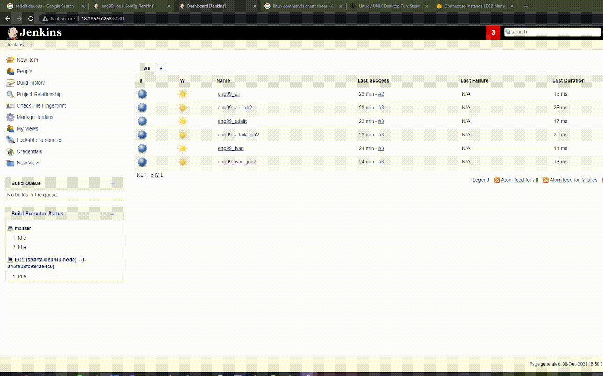

# CICD

# Docker
- best virtualization platform to containerise your app
- Continuous Integration Efficiency with Docker enables you to build a container image and use that same image across every step of the deployment process.
- A huge benefit of this is the ability to separate non-dependent steps and run them in parallel
- Docker does really make it easier to create, deploy, and run applications by using containers, and containers allow a developer to package up an application with all of the parts it needs, such as libraries and dependencies, ship it all out as one package

# CICD
- Continuous Integration (CI): Developers merge/commit code to master branch multiple times a day, fully automated build and test process which gives feedback within few minutes, by doing so, you avoid the integration hell that usually happens when people wait for release day to merge their changes into the release branch.
- Continuous Delivery is an extension of continuous integration to make sure that you can release new changes to your customers quickly in a sustainable way. This means that on top of having automated your testing, you also have automated your release process and you can deploy your application at any point of time by clicking on a button. In continuous Delivery the deployment is completed manually.
- Continuous Deployment goes one step further than continuous delivery, with this practice, every change that passes all stages of your production pipeline is released to your customers, there is no human intervention, and only a failed test will prevent a new change to be deployed to production.
- How CICD Practices relate to each other: To put it simply, the continuous integration is part of both continuous delivery and continuous deployment. The main difference is the deployment step, in continuous delivery the deployment is done manually and in continuous deployment it happens automatically.
- What is a CI CD Pipeline: The CI/CD pipeline is all about automation: Initiating code builds, automated testing, and automated deploying to the staging or production environments. It’s complex and exciting at the same time, but incredibly fast, if the output of any stage fails, the next stage will also fail.

# Jenkins
- Jenkins is an open-source automation server in which the central build and CI process take place, It is a Java-based program with packages for Windows, macOS, & Linux.
- Great range of plugins available, Jenkins supports building, deploying, and automating for software development projects, easy installation, simple and user-friendly interface, extensible with huge community-contributed plugin resource, easy environment configuration in user interface & supports distributed builds with master-slave architecture.

# Jenkins Diagram


## Creating a Jenkins job


## Using a Jenkins job to build another job


## Using a Jenkins test instance to test a branch before merging
- If the dev build succeeds, it will merge with the main branch which can then Initiate the build for the deployment branch
- Ensure the branches to build is */dev
```
# Navigate to app folder
cd app

# Installed npm
npm install

# run the tests
npm test

git checkout main
git merge origin/dev
```
- The post-build portion


## Using Jenkins to deploy to an EC2 instance using Jenkins and webhooks

- Code snippet below (Note IP after unbuntu@ needs to be the EC2 instance IP)
- npm start disabled as it will run as a background process so the build can never finish building
```
ssh -A -o "StrictHostKeyChecking=no" ubuntu@34.243.159.143 <<EOF

# install git
sudo apt-get install git -y
rm -rf Shahrukh_eng99_CICD/

git clone https://github.com/jo763/Shahrukh_eng99_CICD
# Change permission of provision to executable and then executing it
chmod +x /home/ubuntu/Shahrukh_eng99_CICD/environment/app/provision.sh
/home/ubuntu/Shahrukh_eng99_CICD/environment/app/provision.sh
cd /home/ubuntu/Shahrukh_eng99_CICD/app
#sudo apt install npm -y
sudo npm install -y
#npm start
EOF
```
